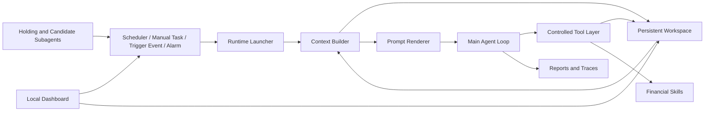

<div align="center">
  
  <br>
  <h1>AstraTrade</h1>
  <p><strong>A Persistent Workspace Architecture for Long-Horizon Financial Agents</strong></p>
  <p>
    <strong>English</strong>
    ·
    <a href="README.zh-CN.md">中文</a>
  </p>
  <p>
    <a href="https://github.com/BryanGao-1216/AstraTrade">GitHub Repository</a>
    ·
    <a href="#abstract">Abstract</a>
    ·
    <a href="#architecture">Architecture</a>
    ·
    <a href="#quick-start">Quick Start</a>
    ·
    <a href="#windows-setup">Windows Setup</a>
    ·
    <a href="#workspace-schema">Workspace Schema</a>
    ·
    <a href="#reproducibility">Reproducibility</a>
  </p>
  <p>
    
    
    
    
    
    
    
  </p>
</div>

---

## Abstract

`AstraTrade` is a local-first research prototype for studying long-horizon financial agents under persistent state, scheduled execution, event-triggered intervention, and auditable decision traces.

Instead of treating an LLM as a stateless trading assistant, AstraTrade frames the agent as a recurrent decision process operating over a durable filesystem workspace. The workspace stores account state, market state, candidate assets, active strategies, holdings, event logs, daily memory, run prompts, model outputs, tool traces, and schema constraints. A mode-aware runtime then rehydrates this workspace into each invocation, allowing the agent to continue a financial research and simulated trading process across market phases, manual instructions, and subagent-generated triggers.

The system is designed for research, simulation, and architecture exploration. It is not financial advice, not an autonomous real-money trading system, and should not be used to execute real transactions without independent human verification.

## Problem Setting

Financial agents differ from one-shot question-answering systems in several important ways:

| Challenge | System Requirement |
| --- | --- |
| Long temporal horizon | The agent must preserve plans, evidence, positions, and unresolved tasks across days. |
| Non-stationary environment | Market phase, risk regime, data availability, and user objectives change over time. |
| Decision accountability | Each action should be traceable to inputs, tool calls, model outputs, and persisted state changes. |
| Mixed initiative | Scheduled jobs, human instructions, alarms, and market subagents all need to wake the same main agent. |
| State integrity | Structured financial state must be updated under explicit schema and file protocols. |

AstraTrade addresses these requirements by placing a persistent workspace between the model and the financial environment. The LLM does not own hidden memory; it reads and writes explicit artifacts through a controlled tool layer.

## Contributions

This repository implements five architectural ideas for long-horizon financial agents:

| Contribution | Description |
| --- | --- |
| Persistent workspace substrate | `workspace/` serves as externalized memory for state, pools, logs, reports, skills, phase descriptions, and daily summaries. |
| Mode-aware recurrent runtime | The main agent can be invoked as `scheduler`, `manual`, or `trigger`, with each mode producing different context and execution constraints. |
| Pool-based financial state model | Holdings, strategies, and candidates are separated into durable pools, enabling monitoring, delayed execution, and multi-step research. |
| Hierarchical agent orchestration | Specialized subagents monitor holdings and candidates during market sessions, then wake the main agent only when a condition requires higher-level reasoning. |
| Auditable execution protocol | Every run stores rendered prompts, final results, step traces, tool calls, protocol retries, and scheduler logs for later inspection. |

## Architecture

<p align="center">
  
</p>

At a high level, AstraTrade consists of a persistent workspace, a runtime context builder, a protocol-constrained agent loop, domain-specific skills, subagents, and a local dashboard.



### 1. Persistent Workspace

The workspace is the central architectural primitive. It makes long-horizon behavior explicit by storing facts and decisions as files:

- `state/` stores account and market state.
- `pools/` stores holdings, strategies, and candidates as JSONL records.
- `logs/` stores trades, events, scheduler output, and per-run execution traces.
- `reports/` stores the rendered prompt and final result for each main-agent run.
- `memory/` stores daily summaries and next-day plans.
- `skills/` stores local financial tools and schema references.
- `phases/` stores market-phase-specific operating instructions.

This design favors observability and reproducibility over opaque hidden memory.

### 2. Runtime and Invocation Modes

The main runtime entry point is `runtime/launcher.py`. Each invocation is normalized into one of three modes:

| Mode | Primary Use | Example |
| --- | --- | --- |
| `scheduler` | Periodic market-phase inspection and routine review. | Premarket planning, intraday check, postmarket review. |
| `manual` | Human-issued natural-language task. | "Analyze whether 300059 should enter the candidate pool." |
| `trigger` | Event-driven response from subagents or external systems. | A candidate reaches a trigger condition. |

The runtime builds a fresh context from the workspace on every call. This context includes time, market phase, trigger metadata, account state, market state, pool summaries, recent trades, and recent events.

### 3. Protocol-Constrained Agent Loop

The main loop in `runtime/agent_loop.py` constrains model output to three JSON message types:

| Type | Purpose |
| --- | --- |
| `thinking` | Brief intermediate reasoning that identifies the next action. |
| `tool_call` | A single structured request to read, write, edit, append, execute, or use skills. |
| `final` | The terminal run summary, including actions, decisions, tool calls, file updates, and next tasks. |

Malformed outputs are fed back to the model as protocol errors and retried. This creates a lightweight execution contract between the model and the environment.

### 4. Controlled Tool Layer

The tool layer in `tools/` mediates all workspace interaction:

- File paths must remain inside `workspace/`.
- Structured writes are checked against the `astra-trade-schema` skill.
- JSON and JSONL files are parsed and validated after write operations.
- Tool results are recorded in run traces.
- Shell execution is restricted by explicit command rules.

This layer is intentionally conservative. It treats financial state as a database-like artifact rather than as free-form text.

### 5. Hierarchical Subagents

Subagents provide narrow, low-cost surveillance loops:

| Subagent | Role |
| --- | --- |
| `holding_follow` | Monitors active holdings and related strategies. |
| `candidate_follow` | Monitors watchlist candidates and trigger conditions. |
| `trading_diary` | Generates a daily narrative diary from account state, market state, pools, trades, and events. |

During market sessions, the scheduler can run subagents every configured interval. When a subagent detects a relevant condition, it records an event and invokes the main agent in `trigger` mode.

### 6. Local Dashboard

The dashboard is a local observability and control surface. It supports:

- Viewing account state, market state, holdings, strategies, candidates, and recent runs.
- Submitting manual tasks.
- Starting and stopping the scheduler.
- Editing API configuration.
- Editing investment-style parameters.
- Inspecting prompts, results, and run traces.

The dashboard is not required for the architecture, but it makes the persistent workspace inspectable and operational.

## Execution Lifecycle

The default lifecycle is configured in `config/scheduler.json`.

| Phase | Mechanism | Typical Operation |
| --- | --- | --- |
| Premarket | Fixed scheduled jobs | Update market view, prepare candidates, review risk constraints. |
| Intraday | Interval subagent checks | Monitor holdings and candidates; escalate triggers to the main agent. |
| Lunch break | Fixed scheduled job | Reassess morning state and unresolved tasks. |
| Postmarket | Fixed scheduled job | Review decisions, update summaries, generate next steps. |
| Evening | Fixed scheduled jobs and diary | Produce retrospective notes and next-day plans. |
| Anytime | Manual task or alarm | Execute user-defined research, review, or delayed follow-up. |

This lifecycle makes the agent recurrent without requiring a constantly running LLM. The scheduler wakes computation only at meaningful times.

## Workspace Schema

Core structured files are documented in `workspace/skills/astra-trade-schema/`.

| File | Description |
| --- | --- |
| `workspace/state/account_state.json` | Cash, assets, market value, position count, and risk limits. |
| `workspace/state/market_state.json` | Market view, risk level, themes, sectors, key events, and evidence. |
| `workspace/pools/holdings.jsonl` | Current holdings and their execution context. |
| `workspace/pools/strategies.jsonl` | Active and pending strategies, including entry, exit, stop-loss, and sizing plans. |
| `workspace/pools/candidates.jsonl` | Watchlist assets, triggers, buy plans, risks, evidence, and next actions. |
| `workspace/logs/trades.jsonl` | Simulated trade records. |
| `workspace/logs/events.jsonl` | External events, subagent triggers, and system events. |
| `workspace/logs/agent_runs.jsonl` | Index of main-agent invocations. |
| `workspace/logs/agent_runs/{run_id}/` | Step-level model outputs, tool results, run summary, and full trace. |
| `workspace/reports/{run_id}_prompt.md` | The exact prompt rendered for a run. |
| `workspace/reports/{run_id}_result.json` | The normalized final result of a run. |
| `workspace/memory/{date}/summary.md` | Daily summary memory. |
| `workspace/memory/{date}/plan.md` | Next-day plan memory. |

Before structured files are modified, the agent is instructed to read the schema skill and corresponding reference. The file tool then performs validation and returns explicit errors when the schema is violated.

## Quick Start

The recommended entry point is the local dashboard.

### 1. Clone

```bash
git clone https://github.com/BryanGao-1216/AstraTrade.git
cd AstraTrade
```

### 2. Initialize

```bash
make setup
```

`make setup` will:

- Create `.venv`.
- Install `requirements.txt`.
- Copy `.env.example` to `.env` when missing.
- Initialize missing workspace state files.
- Generate `workspace/STYLE.md` from `config/investment_style.json`.

### 3. Configure APIs

Edit `.env`:

```bash
LLM_API_KEY=your_llm_api_key
LLM_URL=https://your-openai-compatible-endpoint/v1
LLM_MODEL=your_model_name

SUB_LLM_API_KEY=your_sub_agent_llm_api_key
SUB_LLM_URL=https://your-openai-compatible-endpoint/v1
SUB_LLM_MODEL=your_sub_agent_model_name

MX_APIKEY=your_mx_api_key
MX_API_URL=https://mkapi2.dfcfs.com/finskillshub
```

`SUB_LLM_*` is used by subagents. If omitted, subagents fall back to the main `LLM_*` configuration field by field.

### 4. Start Dashboard

```bash
make dashboard
```

Default URL:

```text
http://127.0.0.1:8787/
```

Custom port:

```bash
make dashboard PORT=9000
```

Direct launch:

```bash
python dashboard/server.py 8787
```

## Windows Setup

The `Makefile` and `dashboard/start.sh` scripts are Unix-oriented. On Windows, `make` may not exist by default, and `sh dashboard/start.sh` can fail because many `sh` implementations do not support `pipefail`.

### Recommended: WSL

Use WSL Ubuntu when possible. Inside WSL, follow the normal Linux/macOS path:

```bash
git clone https://github.com/BryanGao-1216/AstraTrade.git
cd AstraTrade
make setup
make dashboard
```

### Native Windows PowerShell

If you are using PowerShell without `make`, run the equivalent commands manually:

```powershell
git clone https://github.com/BryanGao-1216/AstraTrade.git
cd AstraTrade

py -3 -m venv .venv
.\.venv\Scripts\python.exe -m pip install --upgrade pip
.\.venv\Scripts\pip.exe install -r requirements.txt

if (!(Test-Path .env)) {
  Copy-Item .env.example .env
}
```

Initialize the workspace with Bash if Git for Windows or another Bash environment is installed:

```powershell
bash initialization.sh
.\.venv\Scripts\python.exe -m runtime.investment_style
```

Then edit `.env` and start the dashboard:

```powershell
$env:STOCK_AGENT_PYTHON = ".\.venv\Scripts\python.exe"
.\.venv\Scripts\python.exe dashboard\server.py 8787
```

Open:

```text
http://127.0.0.1:8787/
```

Notes:

- If PowerShell reports that `make` is not recognized, use the PowerShell commands above or switch to WSL.
- If PowerShell reports that `bash` is not recognized, install Git for Windows or use WSL.
- Do not run `sh dashboard/start.sh`; use `bash dashboard/start.sh` in a Bash environment, or start `dashboard\server.py` directly with Python.
- Native Windows virtual environments use `.venv\Scripts\python.exe`, while Linux/macOS and WSL use `.venv/bin/python`.

## Common Commands

| Command | Description |
| --- | --- |
| `make setup` | Create virtual environment, install dependencies, generate `.env`, and initialize workspace. |
| `make dashboard` | Start the local dashboard. |
| `make init` | Reinitialize workspace state, pools, logs, memory, reports, and alarm config. |
| `make run` | Execute one main-agent run in `scheduler` mode. |
| `make scheduler` | Start the long-running scheduler. |
| `make manual TASK="..."` | Execute one human-specified task in `manual` mode. |
| `make style` | Regenerate `workspace/STYLE.md` from investment-style config. |
| `make check` | Compile-check the main Python modules. |
| `make clean` | Remove Python cache files. |

Example:

```bash
make manual TASK="检查当前持仓和候选池，给出下一步观察重点"
```

## Manual Runtime Usage

Run one scheduled inspection:

```bash
python -m runtime.launcher --mode scheduler
```

Run one manual task:

```bash
python -m runtime.launcher --task "分析 300059 是否值得加入候选池"
```

Run one trigger-mode invocation:

```bash
python -m runtime.launcher \
  --mode trigger \
  --trigger-reason manual_trigger \
  --trigger-event '{"source":"manual","symbol":"300059","trigger_type":"manual","reason":"人工检查"}'
```

Start the resident scheduler:

```bash
python -m runtime.agent
```

Run subagents directly:

```bash
python -m subagent.holding_follow.exec_agent
python -m subagent.candidate_follow.exec_agent
python -m subagent.trading_diary.exec_agent
```

Useful subagent flags:

```bash
python -m subagent.holding_follow.exec_agent --dry-run
python -m subagent.holding_follow.exec_agent --no-update
python -m subagent.candidate_follow.exec_agent --dry-run
python -m subagent.candidate_follow.exec_agent --no-update
```

## Repository Layout

```text
AstraTrade/
├── config/
│   ├── alarm.json                   # Delayed and recurring alarm tasks
│   ├── investment_style.json        # Investment-style configuration
│   └── scheduler.json               # Scheduler and subagent configuration
├── dashboard/
│   ├── server.py                    # Local dashboard backend
│   ├── start.sh                     # Dashboard launcher
│   └── static/                      # Dashboard frontend
├── runtime/
│   ├── agent.py                     # Resident scheduler and alarm runner
│   ├── agent_loop.py                # LLM loop and tool-call executor
│   ├── build_context.py             # Runtime context construction
│   ├── investment_style.py          # STYLE.md generator
│   ├── launcher.py                  # Single-run main-agent entry point
│   └── render_prompt.py             # System prompt rendering
├── services/
│   └── llm_service.py               # OpenAI-compatible model client
├── subagent/
│   ├── candidate_follow/            # Candidate monitoring subagent
│   ├── holding_follow/              # Holding monitoring subagent
│   └── trading_diary/               # Daily diary generator
├── system/
│   ├── core_prompt.md               # Core system instruction
│   ├── file_protocol.md             # Workspace file protocol
│   ├── output_contract.md           # JSON output protocol
│   ├── rules.md                     # Runtime behavior rules
│   ├── tools.md                     # Tool definitions
│   └── modes/                       # Mode-specific instructions
├── tools/
│   ├── exec.py                      # Restricted command executor
│   ├── file_tools.py                # Workspace file tools and validation
│   └── list_skills.py               # Skill summary reader
├── workspace/
│   ├── MARKET.md                    # A-share market background
│   ├── STYLE.md                     # Generated style constraints
│   ├── phases/                      # Market-phase instructions
│   ├── skills/                      # Local skills and schemas
│   ├── state/                       # Account and market state
│   ├── pools/                       # Holdings, strategies, candidates
│   ├── logs/                        # Events, trades, scheduler, run traces
│   ├── memory/                      # Daily summary and plan memory
│   └── reports/                     # Rendered prompts and run results
├── .env.example                     # Environment variable template
├── Makefile                         # Common command entry points
├── initialization.sh                 # Workspace initialization script
└── requirements.txt                 # Python dependencies
```

Local `.env`, dashboard runtime files, workspace logs, workspace reports, generated memory, personal test data, and simulated account state should not be treated as portable public artifacts.

## Reproducibility

AstraTrade records enough information to replay the reasoning context of a run:

| Artifact | Reproducibility Role |
| --- | --- |
| Rendered prompt | Captures the exact system prompt, workspace context, skills, and mode instructions sent to the model. |
| Final result | Stores the normalized `final` JSON object returned by the loop. |
| Agent trace | Stores step-level model outputs, tool calls, tool results, parse errors, and timing. |
| Scheduler logs | Records when fixed jobs, subagents, and alarms were triggered. |
| Workspace files | Preserve the durable state that future invocations will read. |

This is useful for debugging model behavior, comparing model configurations, auditing state transitions, and studying long-horizon agent drift.

## Design Principles

| Principle | Implementation |
| --- | --- |
| Explicit memory | The system relies on files, not hidden model state. |
| Bounded agency | The model can act only through declared tools and protocols. |
| Schema-first state | Financial state is validated against local schema references. |
| Human inspectability | Dashboard and run artifacts expose state and execution history. |
| Eventful recurrence | Long-horizon operation emerges from scheduled, manual, alarm, and trigger invocations. |
| Separation of concerns | Main agent decides; subagents monitor; tools mutate; dashboard observes and controls. |

## Financial Skills

The workspace includes local skills for financial data access and simulation-oriented operations:

| Skill | Description |
| --- | --- |
| `mx-data` | Financial data queries through the configured MX data endpoint. |
| `mx-search` | Financial news, announcements, research, policy, and event search. |
| `mx-moni` | Simulation-oriented portfolio or transaction operations. |
| `stock-ranker` | Candidate ranking support. |
| `astra-trade-schema` | Schema references for state, pools, logs, and reports. |
| `astra-trade-alarm` | Natural-language delayed and recurring wake-up tasks. |

The financial skills may call external services when configured with valid credentials. API keys are read from environment variables and should never be committed.

## Limitations and Safety

- This repository is for research, simulation, and system design exploration.
- Outputs may be incomplete, wrong, stale, or based on unavailable data.
- The system should not be connected to real-money execution without additional authentication, risk controls, monitoring, and human approval.
- The LLM must not invent market data, news, financial statements, account state, or tool results.
- Any real financial decision should be independently verified against authoritative data sources and personal risk constraints.

## License

This project is currently private and intended for personal research and development.

All rights reserved. Copying, redistribution, modification, or commercial use is prohibited without permission.
