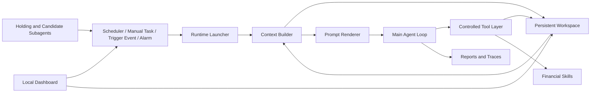

<div align="center">
  
  <br>
  <h1>AstraTrade</h1>
  <p><strong>A Persistent Workspace Architecture for Long-Horizon Financial Agents</strong></p>
  <p>
    <strong>English</strong>
    ·
    <a href="README.zh-CN.md">中文</a>
  </p>
  <p>
    <a href="https://github.com/BryanGao-1216/AstraTrade">GitHub Repository</a>
    ·
    <a href="#abstract">Abstract</a>
    ·
    <a href="#architecture">Architecture</a>
    ·
    <a href="#quick-start">Quick Start</a>
    ·
    <a href="#manual-setup">Manual Setup</a>
    ·
    <a href="#workspace-schema">Workspace Schema</a>
    ·
    <a href="#reproducibility">Reproducibility</a>
  </p>
  <p>
    
    
    
    
    
    
    
  </p>
</div>

---

<a id="abstract"></a>
## Overview

`AstraTrade` is a local-first agent runtime for long-horizon financial research and simulated trading. It gives an OpenAI-compatible LLM a durable workspace, a strict tool protocol, market-aware scheduling, specialized monitoring subagents, and a local dashboard for operating the whole loop.

The project is built around one simple idea: an agent should not rely on hidden memory for stateful financial work. AstraTrade stores account state, market state, holdings, strategies, candidates, events, run prompts, tool traces, and daily memory as explicit files. Every invocation rebuilds context from that workspace, so the agent can continue across market phases, manual tasks, alarms, and subagent triggers.

AstraTrade is intended for research, simulation, workflow design, and agent infrastructure experiments. It is not financial advice, not a broker integration, and not a real-money autonomous trading system.

## What You Can Build

- A persistent financial agent that remembers prior plans, evidence, and unresolved tasks.
- A local simulated trading workspace for A-share research workflows.
- Scheduled market-phase reviews for premarket, intraday, postmarket, and evening routines.
- Event-driven follow-up loops for holdings, candidates, alarms, and manual instructions.
- Auditable agent runs with rendered prompts, final results, tool calls, traces, and state changes.
- A dashboard-driven control surface for running, inspecting, and configuring the agent locally.

## Highlights

| Feature | What it does |
| --- | --- |
| Persistent workspace | Keeps state in `workspace/` instead of relying on opaque model memory. |
| Mode-aware runtime | Runs the main agent as `scheduler`, `manual`, or `trigger` depending on the wake-up source. |
| Protocol-constrained loop | Forces model output through structured `thinking`, `tool_call`, and `final` messages. |
| Controlled tool layer | Restricts file access to the workspace and validates structured JSON/JSONL updates. |
| Pool-based state model | Separates holdings, strategies, and candidates into durable, inspectable pools. |
| Hierarchical subagents | Uses focused agents for holding monitoring, candidate monitoring, and trading diary generation. |
| Local dashboard | Provides a browser UI for state inspection, manual tasks, scheduler control, and API configuration. |

## Architecture

<p align="center">
  
</p>

AstraTrade runs as a loop around a persistent filesystem workspace:



### Core Components

| Component | Path | Role |
| --- | --- | --- |
| Runtime launcher | `runtime/launcher.py` | Builds one run from mode, task, trigger metadata, and workspace state. |
| Context builder | `runtime/build_context.py` | Rehydrates account, market, pool, log, and phase context for each invocation. |
| Prompt renderer | `runtime/render_prompt.py` | Assembles system rules, mode instructions, workspace context, and skill summaries. |
| Agent loop | `runtime/agent_loop.py` | Executes the model/tool protocol and records run artifacts. |
| Scheduler | `runtime/agent.py` | Runs fixed market-phase jobs, alarm checks, and subagent monitoring loops. |
| Tool layer | `tools/` | Mediates file reads, edits, appends, structured validation, skill calls, and restricted commands. |
| Subagents | `subagent/` | Watches holdings and candidates, then escalates meaningful events to the main agent. |
| Dashboard | `dashboard/` | Exposes a local web UI for operation, inspection, and configuration. |

## How It Works

1. A wake-up source starts a run: scheduler, manual task, trigger event, or alarm.
2. The runtime reads `workspace/` and builds a fresh context snapshot.
3. The prompt renderer combines core rules, mode instructions, workspace data, and available skills.
4. The agent loop asks the LLM for structured JSON actions.
5. Tools read or mutate workspace files under path and schema constraints.
6. The run writes prompts, results, traces, events, and state updates back to disk.
7. Future runs continue from the updated workspace.

The result is a recurrent agent that can operate over days without hiding important state inside a chat transcript.

## Quick Start

### Requirements

- Python 3.10+
- macOS, Linux, or WSL
- An OpenAI-compatible LLM endpoint
- Optional MX credentials for market data, search, and simulation skills

### Install

```bash
git clone https://github.com/BryanGao-1216/AstraTrade.git
cd AstraTrade
make setup
```

Edit `.env`:

```bash
LLM_API_KEY=your_llm_api_key
LLM_URL=https://your-openai-compatible-endpoint/v1
LLM_MODEL=your_model_name

SUB_LLM_API_KEY=your_sub_agent_llm_api_key
SUB_LLM_URL=https://your-openai-compatible-endpoint/v1
SUB_LLM_MODEL=your_sub_agent_model_name

MX_APIKEY=your_mx_api_key
MX_API_URL=https://mkapi2.dfcfs.com/finskillshub
```

`SUB_LLM_*` is used by subagents. If a subagent field is empty, AstraTrade falls back to the matching main `LLM_*` value.

### Launch the Dashboard

```bash
make dashboard
```

Open:

```text
http://127.0.0.1:8787/
```

### Run a Manual Task

```bash
make manual TASK="Review the current holdings and candidate pool, then suggest the next observation priorities."
```

### Start the Scheduler

```bash
make scheduler
```

The scheduler uses `config/scheduler.json` to run market-phase jobs, subagent checks, diary generation, and alarm follow-ups.

## Manual Setup

For Windows PowerShell or environments without `make`, run the setup commands manually:

```powershell
git clone https://github.com/BryanGao-1216/AstraTrade.git
cd AstraTrade

py -3 -m venv .venv
.\.venv\Scripts\python.exe -m pip install --upgrade pip
.\.venv\Scripts\pip.exe install -r requirements.txt

if (!(Test-Path .env)) {
  Copy-Item .env.example .env
}
```

Initialize the workspace and generate investment-style instructions:

```powershell
bash initialization.sh
.\.venv\Scripts\python.exe -m runtime.investment_style
notepad .env
```

Start the dashboard:

```powershell
$env:STOCK_AGENT_PYTHON = ".\.venv\Scripts\python.exe"
.\.venv\Scripts\python.exe dashboard\server.py 8787
```

Open:

```text
http://127.0.0.1:8787/
```

## Configuration

| Variable | Required | Description |
| --- | --- | --- |
| `LLM_API_KEY` | Yes | API key for the main OpenAI-compatible model. |
| `LLM_URL` | Yes | Base URL for the main model endpoint. |
| `LLM_MODEL` | Yes | Model name for the main agent. |
| `SUB_LLM_API_KEY` | No | API key for subagents. Falls back to `LLM_API_KEY`. |
| `SUB_LLM_URL` | No | Base URL for subagents. Falls back to `LLM_URL`. |
| `SUB_LLM_MODEL` | No | Model name for subagents. Falls back to `LLM_MODEL`. |
| `MX_APIKEY` | Optional | Credential for MX market data, search, and simulation skills. |
| `MX_API_URL` | Optional | MX service endpoint. |
| `TRADINGAGENTS_TOKEN` | Optional | Token for the optional TradingAgents service. |
| `TRADINGAGENTS_API_URL` | Optional | URL for the optional TradingAgents service. |
| `STOCK_AGENT_PYTHON` | Optional | Python executable used by dashboard-launched subprocesses. |

Never commit real API keys or personal account data.

## Common Commands

| Command | Description |
| --- | --- |
| `make setup` | Create `.venv`, install dependencies, copy `.env`, initialize workspace, and generate `STYLE.md`. |
| `make dashboard` | Start the local dashboard on `PORT`, defaulting to `8787`. |
| `make init` | Reinitialize workspace state, pools, logs, memory, reports, and alarm config. |
| `make run` | Execute one main-agent run in `scheduler` mode. |
| `make scheduler` | Start the resident scheduler. |
| `make manual TASK="..."` | Execute one human-specified task in `manual` mode. |
| `make style` | Regenerate `workspace/STYLE.md` from `config/investment_style.json`. |
| `make check` | Compile-check the main Python modules. |
| `make clean` | Remove Python cache files. |

Direct runtime usage:

```bash
python -m runtime.launcher --mode scheduler
python -m runtime.launcher --task "Analyze whether 300059 should enter the candidate pool."
python -m runtime.agent
```

Trigger-mode example:

```bash
python -m runtime.launcher \
  --mode trigger \
  --trigger-reason manual_trigger \
  --trigger-event '{"source":"manual","symbol":"300059","trigger_type":"manual","reason":"manual review"}'
```

Run subagents directly:

```bash
python -m subagent.holding_follow.exec_agent --dry-run
python -m subagent.candidate_follow.exec_agent --dry-run
python -m subagent.trading_diary.exec_agent
```

## Workspace Schema

The workspace is the durable state layer for the agent. Core structured files are documented in `workspace/skills/astra-trade-schema/`.

| File | Description |
| --- | --- |
| `workspace/state/account_state.json` | Cash, assets, market value, position count, and risk limits. |
| `workspace/state/market_state.json` | Market view, risk level, themes, sectors, key events, and evidence. |
| `workspace/pools/holdings.jsonl` | Current holdings and their execution context. |
| `workspace/pools/strategies.jsonl` | Active and pending strategies, including entry, exit, stop-loss, and sizing plans. |
| `workspace/pools/candidates.jsonl` | Watchlist assets, triggers, buy plans, risks, evidence, and next actions. |
| `workspace/logs/trades.jsonl` | Simulated trade records. |
| `workspace/logs/events.jsonl` | External events, subagent triggers, alarms, and system events. |
| `workspace/logs/agent_runs.jsonl` | Index of main-agent invocations. |
| `workspace/logs/agent_runs/{run_id}/` | Step-level model outputs, tool results, run summary, and full trace. |
| `workspace/reports/{run_id}_prompt.md` | The exact prompt rendered for a run. |
| `workspace/reports/{run_id}_result.json` | The normalized final result of a run. |
| `workspace/memory/{date}/summary.md` | Daily summary memory. |
| `workspace/memory/{date}/plan.md` | Next-day plan memory. |

Structured writes are validated after modification. If a JSON or JSONL update violates the schema, the tool layer returns an explicit error instead of silently corrupting the workspace.

## Financial Skills

AstraTrade ships with local skills under `workspace/skills/`:

| Skill | Description |
| --- | --- |
| `mx-data` | Financial data queries through the configured MX data endpoint. |
| `mx-search` | News, announcements, research, policy, and event search. |
| `mx-moni` | Simulation-oriented portfolio or transaction operations. |
| `stock-ranker` | Candidate ranking support. |
| `astra-trade-schema` | Schema references for state, pools, logs, and reports. |
| `astra-trade-alarm` | Natural-language delayed and recurring wake-up tasks. |
| `tradingagents-analysis-0.6.2` | Optional TradingAgents analysis integration. |

Skills may call external services when configured with valid credentials. Tool outputs should be treated as inputs for verification, not as guaranteed truth.

## Repository Layout

```text
AstraTrade/
├── config/                         # Scheduler, alarm, and investment-style config
├── dashboard/                      # Local dashboard backend and frontend
├── runtime/                        # Main agent runtime, scheduler, context, and prompt rendering
├── services/                       # OpenAI-compatible LLM client and storage helpers
├── subagent/                       # Holding, candidate, and diary subagents
├── system/                         # Core prompt, rules, file protocol, tool contract, and mode prompts
├── tools/                          # Workspace file tools, skill listing, and restricted execution
├── workspace/                      # Persistent state, pools, logs, reports, memory, phases, and skills
├── .env.example                    # Environment variable template
├── Makefile                        # Common command entry points
├── initialization.sh               # Workspace initialization script
└── requirements.txt                # Python dependencies
```

Local `.env`, dashboard runtime files, workspace logs, workspace reports, generated memory, personal test data, and simulated account state should not be treated as portable public artifacts.

## Reproducibility

Every main-agent run records artifacts that make the run inspectable:

| Artifact | Role |
| --- | --- |
| Rendered prompt | Captures the exact system prompt, workspace context, skills, and mode instructions sent to the model. |
| Final result | Stores the normalized `final` JSON object returned by the loop. |
| Agent trace | Stores step-level model outputs, tool calls, tool results, parse errors, and timing. |
| Scheduler logs | Records when fixed jobs, subagents, diary jobs, and alarms were triggered. |
| Workspace files | Preserve the durable state that future invocations will read. |

This makes it easier to debug model behavior, compare model configurations, inspect state transitions, and audit long-horizon drift.

## Safety

- AstraTrade is for research, simulation, and workflow experimentation.
- It does not place real trades and should not be connected to broker execution without separate authentication, risk controls, monitoring, and human approval.
- LLM outputs may be incomplete, stale, or wrong.
- The agent must not invent market data, news, financial statements, account state, or tool results.
- Any real financial decision should be independently verified against authoritative data sources and personal risk constraints.

## License

This project is currently private and intended for personal research and development.

All rights reserved. Copying, redistribution, modification, sublicensing, or commercial use is prohibited without prior written permission.
