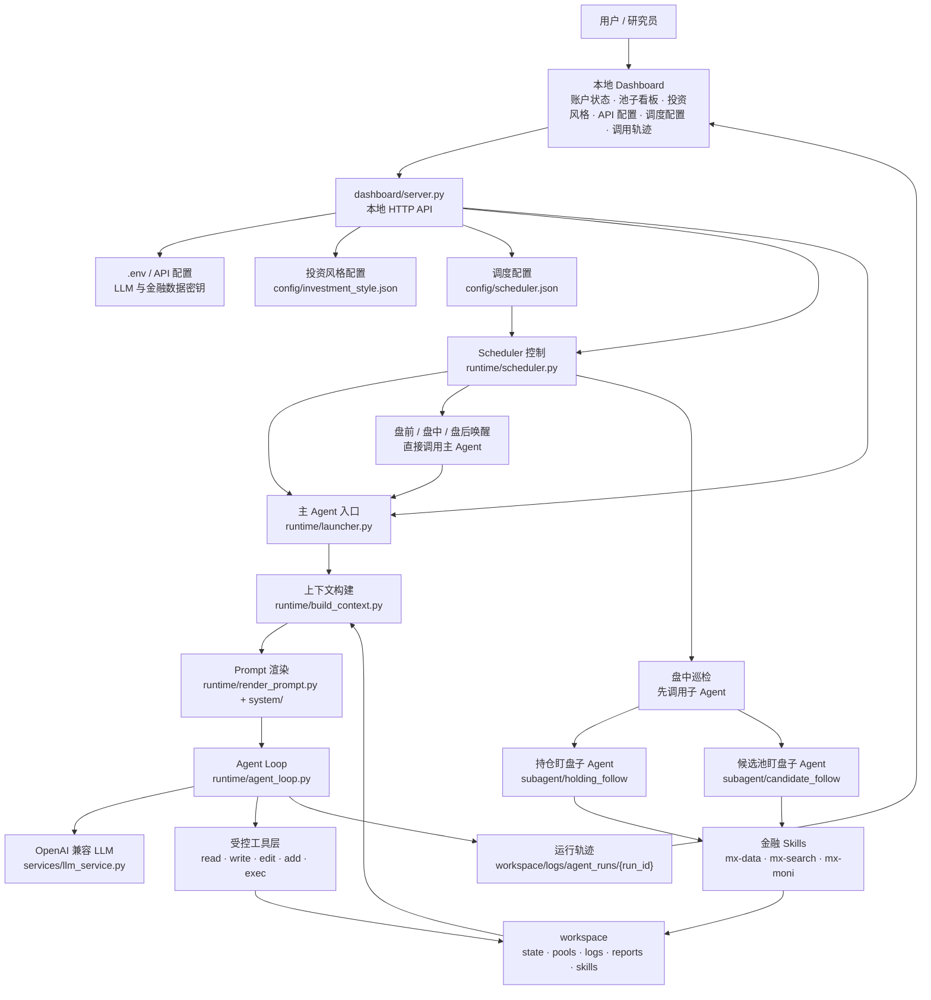

<div align="center">
  <h1>AstraTrade</h1>
  <p><strong>面向 A 股研究、模拟交易与自动化复盘的本地 Agent 控制台</strong></p>
  <p>
    <a href="#快速使用">快速使用</a> ·
    <a href="#系统结构">系统结构</a> ·
    <a href="#常用命令">常用命令</a> ·
    <a href="#运行模式">运行模式</a> ·
    <a href="#数据文件">数据文件</a>
  </p>
  <p>
    
    
    
    
    
  </p>
</div>

---

`AstraTrade` 以本地 `workspace` 作为长期记忆，围绕「账户状态、持仓池、策略池、候选池、市场信息、工具调用、结构化日志」组织运行。它支持定时巡检、人工指令、事件触发、子 Agent 盯盘，并提供一个本地 dashboard 用来查看账户状态、配置投资风格、管理 API、配置 scheduler、触发任务和复盘 Agent 运行轨迹。

> 免责声明：本项目用于研究、模拟交易、策略验证和自动化复盘，不构成投资建议。任何真实交易动作都应由用户自行核验行情、账户、持仓、风控和工具返回结果后再决定。

## 快速使用

dashboard 是项目的默认入口。新用户建议先启动本地控制台，通过页面完成 API 配置、投资风格配置、scheduler 配置、人工指令提交、scheduler 控制和 Agent 运行轨迹复盘。

### 1. 克隆项目

```bash
git clone <your-repo-url>
cd AstraTrade
```

### 2. 一键初始化环境

```bash
make setup
```

`make setup` 会完成：

- 创建 `.venv`
- 安装 `requirements.txt`
- 从 `.env.example` 复制生成本地 `.env`
- 初始化缺失的 `workspace` 状态文件
- 生成 `workspace/STYLE.md`

### 3. 配置 API

编辑 `.env`，填入自己的 API Key 和模型配置：

```bash
LLM_API_KEY=your_llm_api_key
LLM_URL=https://your-openai-compatible-endpoint/v1
LLM_MODEL=your_model_name

MX_APIKEY=your_mx_api_key
MX_API_URL=https://mkapi2.dfcfs.com/finskillshub
```

### 4. 启动 dashboard

```bash
make dashboard
```

默认访问地址：

```text
http://127.0.0.1:8787/
```

指定端口：

```bash
make dashboard PORT=9000
```

### 5. 在页面里完成日常操作

dashboard 启动后可以直接完成：

- 查看账户状态和仓位概览。
- 查看持仓池、策略池、候选池。
- 调整投资风格。
- 配置 API 环境变量。
- 配置自动触发规则，包括盘前唤醒、盘中唤醒、盘后唤醒和盘中巡检。
- 输入人工指令并触发主 Agent。
- 查看主 Agent 调用历史。
- 打开某次调用的详细轨迹，复盘模型输出、工具调用和最终结果。
- 启动/停止 scheduler。
- 初始化 workspace。

dashboard 后端入口：

```bash
python dashboard/server.py 8787
```

脚本入口：

```bash
bash dashboard/start.sh 8787
```

## 系统结构



### 模块说明

| 模块 | 作用 |
| --- | --- |
| Dashboard | 项目的默认入口，用于查看状态、提交人工指令、配置风格/API/scheduler、控制 scheduler 和复盘轨迹 |
| `runtime/launcher.py` | 主 Agent 单次运行入口，负责进入 scheduler、manual 或 trigger 模式 |
| `runtime/agent_loop.py` | LLM 循环与工具调用执行器，记录每一步输入、输出和工具结果 |
| `runtime/scheduler.py` | 常驻调度器，根据 `config/scheduler.json` 执行主 Agent 唤醒和盘中子 Agent 巡检 |
| `subagent/` | 持仓池和候选池盯盘逻辑 |
| `workspace/` | 本地长期记忆，保存状态、池子、日志、报告和 skills |
| `system/` | 核心提示词、模式规则、工具协议和输出协议 |

## 常用命令

| 命令 | 说明 |
| --- | --- |
| `make setup` | 创建虚拟环境、安装依赖、生成 `.env` 和默认 workspace |
| `make dashboard` | 启动本地 dashboard |
| `make init` | 初始化 workspace，清空运行数据并重置账户/市场状态 |
| `make run` | 执行一次主 Agent scheduler 模式 |
| `make scheduler` | 启动常驻 scheduler |
| `make manual TASK="..."` | 执行一条人工自然语言指令 |
| `make style` | 根据投资风格配置重新生成 `workspace/STYLE.md` |
| `make check` | 编译检查主要 Python 文件 |
| `make clean` | 清理 Python 缓存文件 |

示例：

```bash
make manual TASK="检查当前持仓和候选池，给出下一步观察重点"
```

## 特性

- **本地 dashboard 优先**
  - 实时查看账户状态、持仓池、策略池、候选池。
  - 配置投资风格和 API 环境变量。
  - 配置 scheduler：盘前唤醒、盘中唤醒、盘后唤醒和盘中巡检。
  - 提交人工指令。
  - 查看主 Agent 调用历史和逐步运行轨迹。
  - 控制 scheduler 和 workspace 初始化。
- **主 Agent 多模式运行**
  - `scheduler`：根据固定唤醒任务和交易时段自动运行。
  - `manual`：接收人工自然语言指令，优先完成指定任务。
  - `trigger`：响应外部事件，只处理触发事件相关对象。
- **本地 workspace 记忆**
  - `state/`：账户状态、市场状态。
  - `pools/`：持仓池、策略池、候选池。
  - `logs/`：交易、决策、事件和 Agent 运行轨迹。
  - `reports/`：每次运行的 prompt 与结果。
- **金融数据与模拟交易 Skills**
  - `mx-data`：行情、指数、板块、资金、财务等数据。
  - `mx-search`：金融资讯、公告、研报、政策和事件搜索。
  - `mx-moni`：模拟组合查询、买卖、撤单、委托和资金查询。
- **受控工具协议**
  - 支持 `read`、`write`、`edit`、`add`、`exec`、`write_memory`。
  - 文件写入遵循 schema，结构化数据默认追加。
  - `exec` 默认仅允许有限命令，降低误操作风险。
- **投资风格配置**
  - 通过 `config/investment_style.json` 生成 `workspace/STYLE.md`。
  - 可约束投资周期、风险偏好、选股偏好、交易频率、仓位风格和止盈止损风格。

## 手动安装

如果不使用 `make`，可以手动执行：

```bash
python3 -m venv .venv
source .venv/bin/activate
pip install -r requirements.txt
cp .env.example .env
python -m runtime.investment_style
bash dashboard/start.sh 8787
```

## 环境变量

| 变量 | 必填 | 说明 |
| --- | --- | --- |
| `LLM_API_KEY` | 是 | OpenAI 兼容接口密钥 |
| `LLM_URL` | 是 | OpenAI 兼容接口地址，通常以 `/v1` 结尾 |
| `LLM_MODEL` | 是 | 模型名称 |
| `MX_APIKEY` | 否 | 东方财富妙想 Skills API Key，用于金融数据、资讯和模拟组合 |
| `MX_API_URL` | 否 | 妙想 API 地址 |
| `TRADINGAGENTS_TOKEN` | 否 | TradingAgents 服务 Token |
| `TRADINGAGENTS_API_URL` | 否 | TradingAgents 服务地址 |
| `STOCK_AGENT_PYTHON` | 否 | 指定 dashboard 启动 Agent 子进程时使用的 Python |

## 运行模式

### Scheduler 模式

执行一次 scheduler 巡检：

```bash
python -m runtime.launcher --mode scheduler
```

启动常驻调度器：

```bash
python -m runtime.scheduler
```

调度规则位于 `config/scheduler.json`，默认包含：

- 工作日运行。
- 盘前唤醒、盘中唤醒、盘后唤醒：固定时间直接唤醒主 Agent。
- 盘中巡检：交易时段每 10 分钟先运行持仓/候选池子 Agent，再由子 Agent 按需触发主 Agent。
- 盘中巡检子 Agent：默认包含 `holding_follow` 和 `candidate_follow`。
- 日志写入 `workspace/logs/scheduler/`。

也可以在 dashboard 的「调度配置」页面修改这些规则。当前页面支持修改固定唤醒任务、盘中巡检时段、已有子 Agent 的启用状态和命令；不支持用户直接新增子 Agent。

### Manual 模式

只要传入 `--task`，系统会进入人工任务模式：

```bash
python -m runtime.launcher --task "分析 300059 是否值得加入候选池"
```

### Trigger 模式

用于外部事件触发：

```bash
python -m runtime.launcher \
  --mode trigger \
  --trigger-reason manual_trigger \
  --trigger-event '{"source":"manual","symbol":"300059","trigger_type":"manual","reason":"人工检查"}'
```

## 子 Agent

子 Agent 用于盘中巡检。scheduler 会在交易时段先调用已有子 Agent，同步持仓或候选池状态，并在满足条件时按需唤醒主 Agent。

当前 dashboard 不支持用户新增子 Agent；页面只能配置已有子 Agent 的启用状态和命令。若需要新增一种子 Agent，需要在代码中实现对应模块，并同步更新调度配置与执行逻辑。

### 持仓盯盘

```bash
python -m subagent.holding_follow.exec_agent
```

常用参数：

```bash
python -m subagent.holding_follow.exec_agent --dry-run
python -m subagent.holding_follow.exec_agent --no-update
```

### 候选池盯盘

```bash
python -m subagent.candidate_follow.exec_agent
```

常用参数：

```bash
python -m subagent.candidate_follow.exec_agent --dry-run
python -m subagent.candidate_follow.exec_agent --no-update
```

## 目录结构

```text
AstraTrade/
├── config/
│   ├── investment_style.json        # 投资风格配置
│   └── scheduler.json               # 调度配置
├── dashboard/
│   ├── server.py                    # dashboard 后端
│   ├── start.sh                     # dashboard 启动脚本
│   └── static/                      # dashboard 前端
├── runtime/
│   ├── agent_loop.py                # LLM 循环和工具调用执行器
│   ├── build_context.py             # 动态上下文构建
│   ├── investment_style.py          # 投资风格生成器
│   ├── launcher.py                  # 主 Agent 单次运行入口
│   ├── render_prompt.py             # 系统 prompt 渲染
│   └── scheduler.py                 # 常驻调度器
├── services/
│   └── llm_service.py               # OpenAI 兼容模型调用
├── subagent/
│   ├── candidate_follow/            # 候选池盯盘子 Agent
│   └── holding_follow/              # 持仓盯盘子 Agent
├── system/
│   ├── core_prompt.md               # 核心系统提示
│   ├── file_protocol.md             # 文件读写协议
│   ├── output_contract.md           # 输出协议
│   ├── rules.md                     # 行为规则
│   ├── tools.md                     # 工具定义
│   └── modes/                       # scheduler/manual/trigger 模式规则
├── tools/
│   ├── exec.py                      # 受限命令执行
│   ├── file_tools.py                # workspace 文件工具
│   └── list_skills.py               # skills 摘要读取
├── workspace/
│   ├── MARKET.md                    # A 股市场背景
│   ├── STYLE.md                     # 生成后的投资风格约束
│   ├── phases/                      # 不同交易阶段说明
│   ├── skills/                      # 本地 skills 与数据 schema
│   ├── state/                       # 账户和市场状态
│   ├── pools/                       # 持仓池、策略池、候选池
│   ├── logs/                        # 运行日志
│   └── reports/                     # prompt 和结果输出
├── .env.example                     # 环境变量模板
├── Makefile                         # 常用命令入口
├── initialization.sh                 # workspace 初始化脚本
└── requirements.txt                  # Python 依赖
```

## 数据文件

核心结构化文件定义在 `workspace/skills/astra-trade-schema/`。

常用运行文件：

| 文件 | 说明 |
| --- | --- |
| `workspace/state/account_state.json` | 账户资金、资产、仓位和风控限制 |
| `workspace/state/market_state.json` | 市场观点、风险等级、热点、关注方向 |
| `workspace/pools/holdings.jsonl` | 当前持仓 |
| `workspace/pools/strategies.jsonl` | 策略池 |
| `workspace/pools/candidates.jsonl` | 候选池 |
| `workspace/logs/trades.jsonl` | 交易记录 |
| `workspace/logs/decisions.jsonl` | 关键决策记录 |
| `workspace/logs/events.jsonl` | 外部事件、子 Agent 触发事件和系统事件 |
| `workspace/logs/agent_runs/{run_id}/` | 单次 Agent 调用的逐步轨迹 |
| `workspace/reports/{run_id}_prompt.md` | 本轮发送给模型的完整 prompt |
| `workspace/reports/{run_id}_result.json` | 本轮最终结果 |

## 输出协议

主 Agent 最终输出遵循 `system/output_contract.md`，核心结构类似：

```json
{
  "type": "final",
  "mode": "scheduler | manual | trigger",
  "phase": "premarket | intraday | lunch_break | postmarket | unknown",
  "summary": "本轮总结",
  "actions": [],
  "tool_calls": [],
  "decisions": [],
  "file_updates": [],
  "next_todos": []
}
```

## License

本项目目前为私人项目，仅用于个人研究与开发。

保留所有权利。未经许可，禁止复制、分发、修改或用于商业用途。
