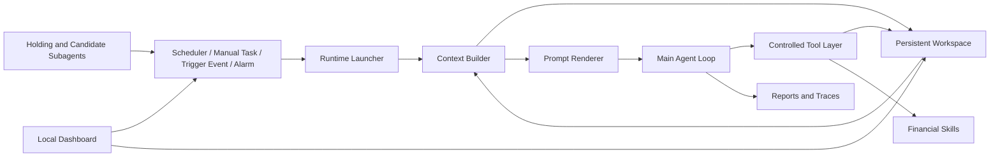

<div align="center">
  
  <br>
  <h1>AstraTrade</h1>
  <p><strong>面向长周期金融智能体的持久工作空间架构</strong></p>
  <p>
    <a href="README.md">English</a>
    ·
    <strong>中文</strong>
  </p>
  <p>
    <a href="https://github.com/BryanGao-1216/AstraTrade">GitHub Repository</a>
    ·
    <a href="#摘要">摘要</a>
    ·
    <a href="#架构">架构</a>
    ·
    <a href="#快速开始">快速开始</a>
    ·
    <a href="#手动配置">手动配置</a>
    ·
    <a href="#工作空间-schema">工作空间 Schema</a>
    ·
    <a href="#可复现性">可复现性</a>
  </p>
  <p>
    
    
    
    
    
    
    
  </p>
</div>

---

<a id="摘要"></a>
## 概览

`AstraTrade` 是一个本地优先的长周期金融 agent runtime，用于搭建金融研究、模拟交易、候选池跟踪、持仓巡检和复盘工作流。它为 OpenAI-compatible LLM 提供持久工作空间、严格的工具协议、市场阶段调度、专用子 Agent，以及一个用于本地运行和观察的 Dashboard。

项目的核心思想很直接：金融 agent 不应该把重要状态藏在聊天上下文里。AstraTrade 将账户状态、市场状态、持仓、策略、候选池、事件、运行 prompt、工具轨迹和日度记忆全部写入显式文件。每次唤醒时，runtime 都从 `workspace/` 重新构建上下文，让 agent 可以跨市场阶段、人工任务、Alarm 和子 Agent 触发事件持续工作。

AstraTrade 面向研究、模拟、流程设计和 agent 基础设施实验。它不构成投资建议，不是券商交易接口，也不是可直接接入真实资金的全自动交易系统。

## 可以用它做什么

- 构建一个能跨天保存计划、证据和未完成事项的金融 agent。
- 搭建本地 A 股研究与模拟交易工作空间。
- 按盘前、盘中、盘后、晚间等市场阶段执行定时巡检。
- 对持仓、候选池、Alarm 和人工任务进行事件驱动跟进。
- 保存每次运行的 prompt、最终结果、工具调用、trace 和状态变更，方便审计。
- 通过本地 Dashboard 运行、检查、配置和控制整个 agent loop。

## 功能亮点

| 能力 | 说明 |
| --- | --- |
| 持久工作空间 | 用 `workspace/` 保存显式状态，而不是依赖不透明的模型记忆。 |
| 模式感知 runtime | 根据唤醒来源，以 `scheduler`、`manual` 或 `trigger` 模式运行主 Agent。 |
| 协议约束 loop | 将模型输出限制为结构化的 `thinking`、`tool_call` 和 `final` 消息。 |
| 受控工具层 | 限制文件访问范围，并校验 JSON/JSONL 结构化写入。 |
| 池化状态模型 | 将持仓、策略和候选资产拆成持久、可检查的 pools。 |
| 层级化子 Agent | 用专门的子 Agent 监控持仓、候选池，并生成日度交易日记。 |
| 本地 Dashboard | 提供状态查看、人工任务、scheduler 控制和 API 配置界面。 |

## 架构

<p align="center">
  
</p>

AstraTrade 围绕一个持久文件系统工作空间运行：



### 核心组件

| 组件 | 路径 | 作用 |
| --- | --- | --- |
| Runtime launcher | `runtime/launcher.py` | 根据模式、任务、触发元数据和 workspace 状态构建单次运行。 |
| Context builder | `runtime/build_context.py` | 为每次调用重新加载账户、市场、池子、日志和市场阶段上下文。 |
| Prompt renderer | `runtime/render_prompt.py` | 组装系统规则、模式说明、workspace 上下文和 skill 摘要。 |
| Agent loop | `runtime/agent_loop.py` | 执行模型/工具协议，并记录运行 artifacts。 |
| Scheduler | `runtime/agent.py` | 运行固定市场阶段任务、Alarm 检查和子 Agent 监控循环。 |
| Tool layer | `tools/` | 负责文件读写、追加、结构校验、skill 调用和受限命令执行。 |
| Subagents | `subagent/` | 监控持仓和候选池，并将有意义的事件升级给主 Agent。 |
| Dashboard | `dashboard/` | 提供本地 Web UI，用于操作、检查和配置。 |


## 快速开始

### 环境要求

- Python 3.11.x

### 安装

```bash
git clone https://github.com/BryanGao-1216/AstraTrade.git
cd AstraTrade
make setup
```

`make setup` 会先查找 Python 3.11；如果本机没有，会尝试通过 `uv`、Homebrew、常见 Linux 包管理器或 `pyenv` 安装，然后用 Python 3.11 创建 `.venv`。如果已有 `.venv` 不是 Python 3.11，setup 会重建它。如果你要指定解释器，可以运行：

```bash
make setup PYTHON=/absolute/path/to/python3.11
```

编辑 `.env`：

```bash
LLM_API_KEY=your_llm_api_key
LLM_URL=https://your-openai-compatible-endpoint/v1
LLM_MODEL=your_model_name

SUB_LLM_API_KEY=your_sub_agent_llm_api_key
SUB_LLM_URL=https://your-openai-compatible-endpoint/v1
SUB_LLM_MODEL=your_sub_agent_model_name

MX_APIKEY=your_mx_api_key
MX_API_URL=https://mkapi2.dfcfs.com/finskillshub
```

`SUB_LLM_*` 供子 Agent 使用。若某一项为空，AstraTrade 会逐项回退到主 Agent 对应的 `LLM_*` 配置。
本项目依赖东方财富APP提供的妙想Skill获取市场、股票等信息，需要在东方财富APP搜索妙想并获取API-KEY(每天有足够的免费调用次数)。

### 启动 Dashboard

```bash
make dashboard
```

访问：

```text
http://127.0.0.1:8787/
```

### 运行一条人工任务

```bash
make manual TASK="检查当前持仓和候选池，给出下一步观察重点。"
```

### 启动 Scheduler

```bash
make scheduler
```

Scheduler 会根据 `config/scheduler.json` 运行市场阶段任务、子 Agent 检查、日记生成和 Alarm 跟进。

## 手动配置

如果在 Windows PowerShell 中使用项目，或者当前环境没有 `make`，可以手动执行：

```powershell
git clone https://github.com/BryanGao-1216/AstraTrade.git
cd AstraTrade

py -3.11 -m venv .venv
.\.venv\Scripts\python.exe -m pip install --upgrade pip
.\.venv\Scripts\pip.exe install -r requirements.txt

if (!(Test-Path .env)) {
  Copy-Item .env.example .env
}
```

初始化 workspace 并生成投资风格说明：

```powershell
bash initialization.sh
.\.venv\Scripts\python.exe -m runtime.investment_style
notepad .env
```

启动 Dashboard：

```powershell
$env:STOCK_AGENT_PYTHON = ".\.venv\Scripts\python.exe"
.\.venv\Scripts\python.exe dashboard\server.py 8787
```

访问：

```text
http://127.0.0.1:8787/
```

## 配置

| 变量 | 是否必需 | 说明 |
| --- | --- | --- |
| `LLM_API_KEY` | 是 | 主 Agent 使用的 OpenAI-compatible 模型 API key。 |
| `LLM_URL` | 是 | 主模型 endpoint base URL。 |
| `LLM_MODEL` | 是 | 主 Agent 模型名称。 |
| `SUB_LLM_API_KEY` | 否 | 子 Agent API key，未配置时回退到 `LLM_API_KEY`。 |
| `SUB_LLM_URL` | 否 | 子 Agent endpoint，未配置时回退到 `LLM_URL`。 |
| `SUB_LLM_MODEL` | 否 | 子 Agent 模型名称，未配置时回退到 `LLM_MODEL`。 |
| `MX_APIKEY` | 是 | 行情、搜索和模拟操作 skills 的API key，通过东方财富APP获取。 |
| `MX_API_URL` | 是 | 东方财富妙想服务 endpoint。 |
| `TRADINGAGENTS_TOKEN` | 可选 | 可选 TradingAgents 服务 token。 |
| `TRADINGAGENTS_API_URL` | 可选 | 可选 TradingAgents 服务 URL。 |
| `STOCK_AGENT_PYTHON` | 可选 | Dashboard 启动 agent 子进程时使用的 Python 路径。 |

## 常用命令

| 命令 | 说明 |
| --- | --- |
| `make setup` | 确保 Python 3.11、创建 `.venv`、安装依赖、复制 `.env`、初始化 workspace 并生成 `STYLE.md`。 |
| `make dashboard` | 在 `PORT` 上启动本地 Dashboard，默认端口为 `8787`。 |
| `make init` | 重新初始化 workspace 状态、池子、日志、记忆、报告和 Alarm 配置。 |
| `make run` | 以 `scheduler` 模式执行一次主 Agent。 |
| `make scheduler` | 启动常驻 Scheduler。 |
| `make manual TASK="..."` | 以 `manual` 模式执行一条人工任务。 |
| `make style` | 根据 `config/investment_style.json` 重新生成 `workspace/STYLE.md`。 |
| `make check` | 对主要 Python 模块执行编译检查。 |
| `make clean` | 清理 Python 缓存文件。 |

直接运行 runtime：

```bash
.venv/bin/python -m runtime.launcher --mode scheduler
.venv/bin/python -m runtime.launcher --task "分析 300059 是否值得加入候选池。"
.venv/bin/python -m runtime.agent
```

Trigger 模式示例：

```bash
python -m runtime.launcher \
  --mode trigger \
  --trigger-reason manual_trigger \
  --trigger-event '{"source":"manual","symbol":"300059","trigger_type":"manual","reason":"人工检查"}'
```

直接运行子 Agent：

```bash
python -m subagent.holding_follow.exec_agent --dry-run
python -m subagent.candidate_follow.exec_agent --dry-run
python -m subagent.trading_diary.exec_agent
```

## 工作空间 Schema

`workspace/` 是 agent 的持久状态层。核心结构化文件定义在 `workspace/skills/astra-trade-schema/`。

| 文件 | 说明 |
| --- | --- |
| `workspace/state/account_state.json` | 现金、总资产、市值、持仓数量和风控限制。 |
| `workspace/state/market_state.json` | 市场观点、风险等级、主题、板块、关键事件和证据。 |
| `workspace/pools/holdings.jsonl` | 当前持仓及其执行上下文。 |
| `workspace/pools/strategies.jsonl` | 活跃和待执行策略，包括买入、卖出、止损和仓位计划。 |
| `workspace/pools/candidates.jsonl` | 候选资产、触发器、买入计划、风险、证据和下一步动作。 |
| `workspace/logs/trades.jsonl` | 模拟交易记录。 |
| `workspace/logs/events.jsonl` | 外部事件、子 Agent 触发事件、Alarm 和系统事件。 |
| `workspace/logs/agent_runs.jsonl` | 主 Agent 调用索引。 |
| `workspace/logs/agent_runs/{run_id}/` | 步骤级模型输出、工具结果、运行摘要和完整 trace。 |
| `workspace/reports/{run_id}_prompt.md` | 某次运行实际渲染出的完整 prompt。 |
| `workspace/reports/{run_id}_result.json` | 某次运行规范化后的最终结果。 |
| `workspace/memory/{date}/summary.md` | 日度总结记忆。 |
| `workspace/memory/{date}/plan.md` | 次日计划记忆。 |

结构化写入会在修改后进行校验。如果 JSON 或 JSONL 更新违反 schema，工具层会返回明确错误，而不是悄悄污染 workspace。

## 金融 Skills

AstraTrade 在 `workspace/skills/` 下内置了本地 skills：

| Skill | 说明 |
| --- | --- |
| `mx-data` | 通过配置的 MX 数据端点查询金融数据。 |
| `mx-search` | 搜索新闻、公告、研报、政策和事件。 |
| `mx-moni` | 面向模拟组合或交易操作的 skill。 |
| `stock-ranker` | 候选资产排序支持。 |
| `astra-trade-schema` | state、pools、logs 和 reports 的 schema reference。 |
| `astra-trade-alarm` | 自然语言延迟和周期性唤醒任务。 |
| `tradingagents-analysis-0.6.2` | 可选 TradingAgents 分析集成。 |

配置有效凭据后，skills 可能访问外部服务。工具输出应作为可核验输入，而不是天然可信事实。

## 仓库结构

```text
AstraTrade/
├── config/                         # Scheduler、Alarm 和投资风格配置
├── dashboard/                      # 本地 Dashboard 后端与前端
├── runtime/                        # 主 Agent runtime、scheduler、context 和 prompt 渲染
├── services/                       # OpenAI-compatible LLM 客户端与存储辅助
├── subagent/                       # 持仓、候选池和日记子 Agent
├── system/                         # 核心 prompt、规则、文件协议、工具契约和模式提示
├── tools/                          # Workspace 文件工具、skill 列表读取和受限执行
├── workspace/                      # 持久状态、池子、日志、报告、记忆、阶段和 skills
├── .env.example                    # 环境变量模板
├── Makefile                        # 常用命令入口
├── initialization.sh               # Workspace 初始化脚本
└── requirements.txt                # Python 依赖
```

## 许可证

本项目基于 MIT 许可证开源，详情请参见 LICENSE 文件。
