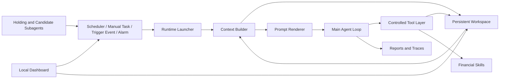

<div align="center">
  
  <br>
  <h1>AstraTrade</h1>
  <p><strong>面向长周期金融智能体的持久工作空间架构</strong></p>
  <p>
    <a href="README.md">English</a>
    ·
    <strong>中文</strong>
  </p>
  <p>
    <a href="https://github.com/BryanGao-1216/AstraTrade">GitHub Repository</a>
    ·
    <a href="#摘要">摘要</a>
    ·
    <a href="#架构">架构</a>
    ·
    <a href="#快速开始">快速开始</a>
    ·
    <a href="#手动配置">手动配置</a>
    ·
    <a href="#工作空间-schema">工作空间 Schema</a>
    ·
    <a href="#可复现性">可复现性</a>
  </p>
  <p>
    
    
    
    
    
    
    
  </p>
</div>

---

## 摘要

`AstraTrade` 是一个本地优先的研究原型，用于探索长周期金融智能体在持久状态、定时执行、事件触发干预和可审计决策轨迹下的系统架构。

与将 LLM 视为无状态交易助手不同，AstraTrade 将智能体建模为运行在持久文件系统工作空间之上的递归决策过程。该工作空间保存账户状态、市场状态、候选资产、活跃策略、持仓、事件日志、日度记忆、运行 prompt、模型输出、工具轨迹和 schema 约束。每次唤醒时，模式感知的 runtime 会重新从工作空间构建上下文，使智能体能够跨越市场阶段、人工指令和子 Agent 触发事件，持续推进金融研究与模拟交易流程。

本系统面向研究、模拟和架构探索，不构成投资建议，也不是可直接用于真实资金交易的全自动系统。任何真实交易动作都应在用户独立核验行情、账户、持仓、风险和工具返回结果后再决定。

## 问题设定

金融智能体与一次性问答系统存在几个关键差异：

| 挑战 | 系统需求 |
| --- | --- |
| 长时间跨度 | 智能体需要跨天保存计划、证据、持仓和未完成事项。 |
| 非平稳环境 | 市场阶段、风险状态、数据可用性和用户目标会持续变化。 |
| 决策可问责 | 每个动作都应能追溯到输入、工具调用、模型输出和持久化状态更新。 |
| 混合主动性 | 定时任务、人工指令、Alarm 和市场子 Agent 都需要唤醒同一个主 Agent。 |
| 状态完整性 | 结构化金融状态必须在明确 schema 和文件协议下更新。 |

AstraTrade 的核心做法是在模型与金融环境之间引入一个持久工作空间。LLM 不拥有隐式隐藏记忆，而是通过受控工具层读取和写入显式 artifacts。

## 核心贡献

本仓库实现了五个面向长周期金融智能体的架构思想：

| 贡献 | 说明 |
| --- | --- |
| 持久工作空间基底 | `workspace/` 作为外部化记忆，保存状态、池子、日志、报告、skills、市场阶段说明和日度总结。 |
| 模式感知递归 runtime | 主 Agent 可通过 `scheduler`、`manual` 或 `trigger` 三种模式被调用，每种模式拥有不同上下文和执行约束。 |
| 池化金融状态模型 | 持仓、策略和候选资产被拆分为持久化池子，支持监控、延迟执行和多步研究。 |
| 层级化 Agent 编排 | 专门的子 Agent 在交易时段监控持仓和候选资产，仅在满足条件时唤醒主 Agent 进行高阶推理。 |
| 可审计执行协议 | 每次运行都会保存渲染后的 prompt、最终结果、步骤轨迹、工具调用、协议重试和 scheduler 日志。 |

## 架构

<p align="center">
  
</p>

从整体上看，AstraTrade 由持久工作空间、运行时上下文构建器、受协议约束的 Agent Loop、领域 skills、子 Agent 和本地 dashboard 组成。



### 1. 持久工作空间

工作空间是本项目最核心的架构原语。它通过文件保存事实和决策，使长周期行为显式可见：

- `state/` 保存账户状态和市场状态。
- `pools/` 以 JSONL 记录保存持仓、策略和候选资产。
- `logs/` 保存交易、事件、scheduler 输出和单次运行轨迹。
- `reports/` 保存每次主 Agent 运行的渲染 prompt 和最终结果。
- `memory/` 保存日度总结和次日计划。
- `skills/` 保存本地金融工具和 schema 引用。
- `phases/` 保存不同市场阶段下的操作说明。

这种设计优先保证可观察性和可复现性，而不是依赖不透明的模型隐藏记忆。

### 2. Runtime 与调用模式

主 runtime 入口是 `runtime/launcher.py`。每次调用都会被规范化为以下三种模式之一：

| 模式 | 主要用途 | 示例 |
| --- | --- | --- |
| `scheduler` | 周期性市场阶段巡检与常规复盘。 | 盘前计划、盘中检查、盘后复盘。 |
| `manual` | 人类发起的自然语言任务。 | “分析 300059 是否值得加入候选池。” |
| `trigger` | 来自子 Agent 或外部系统的事件驱动响应。 | 某个候选标的达到触发条件。 |

runtime 会在每次调用时从工作空间重新构建上下文，包括时间、市场阶段、触发元数据、账户状态、市场状态、池子摘要、近期交易和近期事件。

### 3. 协议约束的 Agent Loop

`runtime/agent_loop.py` 将模型输出约束为三类 JSON 消息：

| 类型 | 作用 |
| --- | --- |
| `thinking` | 简短的中间推理，用于确认下一步动作。 |
| `tool_call` | 对读取、写入、编辑、追加、执行命令或使用 skill 的单次结构化请求。 |
| `final` | 终止本轮运行的总结，包含动作、决策、工具调用、文件更新和后续事项。 |

如果模型输出格式错误，Agent Loop 会把协议错误反馈给模型并要求重试。这在模型与环境之间形成了轻量级执行契约。

### 4. 受控工具层

`tools/` 中的工具层负责调停所有工作空间交互：

- 文件路径必须位于 `workspace/` 内。
- 结构化写入会依据 `astra-trade-schema` skill 校验。
- JSON 和 JSONL 文件会在写入后解析和验证。
- 工具结果会被记录到运行轨迹中。
- Shell 执行受到显式命令规则限制。

该层有意保持保守，将金融状态视为接近数据库的 artifact，而不是任意自由文本。

### 5. 层级化子 Agent

子 Agent 提供窄任务、低成本的监控循环：

| 子 Agent | 作用 |
| --- | --- |
| `holding_follow` | 监控活跃持仓及其相关策略。 |
| `candidate_follow` | 监控候选池标的和触发条件。 |
| `trading_diary` | 根据账户状态、市场状态、池子、交易和事件生成日度交易日记。 |

在交易时段，scheduler 可以按配置间隔运行子 Agent。当子 Agent 检测到相关条件时，它会记录事件并以 `trigger` 模式调用主 Agent。

### 6. 本地 Dashboard

dashboard 是本地可观察性与控制界面，支持：

- 查看账户状态、市场状态、持仓、策略、候选资产和近期运行。
- 提交人工任务。
- 启动和停止 scheduler。
- 编辑 API 配置。
- 编辑投资风格参数。
- 检查 prompt、结果和运行轨迹。

dashboard 不是架构运行的必需组件，但它让持久工作空间更容易被检查和操作。

## 执行生命周期

默认生命周期由 `config/scheduler.json` 配置。

| 阶段 | 机制 | 典型操作 |
| --- | --- | --- |
| 盘前 | 固定定时任务 | 更新市场观点、准备候选资产、检查风险约束。 |
| 盘中 | 间隔子 Agent 巡检 | 监控持仓和候选资产，并将触发事件升级给主 Agent。 |
| 午休 | 固定定时任务 | 重新评估上午状态和未完成事项。 |
| 盘后 | 固定定时任务 | 复盘决策、更新总结、生成后续步骤。 |
| 晚间 | 固定定时任务和日记 | 生成回顾笔记和次日计划。 |
| 任意时间 | 人工任务或 Alarm | 执行用户指定研究、复查或延迟跟进任务。 |

这种生命周期让智能体具备递归运行能力，同时不需要 LLM 常驻运行。scheduler 只在有意义的时点唤醒计算。

## 工作空间 Schema

核心结构化文件定义在 `workspace/skills/astra-trade-schema/`。

| 文件 | 说明 |
| --- | --- |
| `workspace/state/account_state.json` | 现金、总资产、市值、持仓数量和风控限制。 |
| `workspace/state/market_state.json` | 市场观点、风险等级、主题、板块、关键事件和证据。 |
| `workspace/pools/holdings.jsonl` | 当前持仓及其执行上下文。 |
| `workspace/pools/strategies.jsonl` | 活跃和待执行策略，包括买入、卖出、止损和仓位计划。 |
| `workspace/pools/candidates.jsonl` | 候选资产、触发器、买入计划、风险、证据和下一步动作。 |
| `workspace/logs/trades.jsonl` | 模拟交易记录。 |
| `workspace/logs/events.jsonl` | 外部事件、子 Agent 触发事件和系统事件。 |
| `workspace/logs/agent_runs.jsonl` | 主 Agent 调用索引。 |
| `workspace/logs/agent_runs/{run_id}/` | 步骤级模型输出、工具结果、运行摘要和完整轨迹。 |
| `workspace/reports/{run_id}_prompt.md` | 某次运行实际发送给模型的完整 prompt。 |
| `workspace/reports/{run_id}_result.json` | 某次运行规范化后的最终结果。 |
| `workspace/memory/{date}/summary.md` | 日度总结记忆。 |
| `workspace/memory/{date}/plan.md` | 次日计划记忆。 |

在修改结构化文件前，系统会要求 Agent 读取 schema skill 及对应 reference。文件工具会进行验证，并在 schema 不满足时返回明确错误。

## 快速开始

默认适用于 Linux、macOS 或 WSL：

```bash
git clone https://github.com/BryanGao-1216/AstraTrade.git
cd AstraTrade
make setup
```

编辑 `.env`：

```bash
LLM_API_KEY=your_llm_api_key
LLM_URL=https://your-openai-compatible-endpoint/v1
LLM_MODEL=your_model_name

SUB_LLM_API_KEY=your_sub_agent_llm_api_key
SUB_LLM_URL=https://your-openai-compatible-endpoint/v1
SUB_LLM_MODEL=your_sub_agent_model_name

MX_APIKEY=your_mx_api_key
MX_API_URL=https://mkapi2.dfcfs.com/finskillshub
```

`SUB_LLM_*` 供子 Agent 使用。若不配置，子 Agent 会逐项回退到主 Agent 的 `LLM_*` 配置。

```bash
make dashboard
```

访问：

```text
http://127.0.0.1:8787/
```

## 手动配置

如果在 Windows PowerShell 中使用项目，或者当前环境没有 `make`，可以手动逐条执行：

```powershell
git clone https://github.com/BryanGao-1216/AstraTrade.git
cd AstraTrade

py -3 -m venv .venv
.\.venv\Scripts\python.exe -m pip install --upgrade pip
.\.venv\Scripts\pip.exe install -r requirements.txt

if (!(Test-Path .env)) {
  Copy-Item .env.example .env
}
```

```powershell
bash initialization.sh
.\.venv\Scripts\python.exe -m runtime.investment_style
notepad .env
```

```powershell
$env:STOCK_AGENT_PYTHON = ".\.venv\Scripts\python.exe"
.\.venv\Scripts\python.exe dashboard\server.py 8787
```

访问：

```text
http://127.0.0.1:8787/
```

## 常用命令

| 命令 | 说明 |
| --- | --- |
| `make setup` | 创建虚拟环境、安装依赖、生成 `.env` 并初始化 workspace。 |
| `make dashboard` | 启动本地 dashboard。 |
| `make init` | 重新初始化 workspace 状态、池子、日志、记忆、报告和 Alarm 配置。 |
| `make run` | 以 `scheduler` 模式执行一次主 Agent。 |
| `make scheduler` | 启动常驻 scheduler。 |
| `make manual TASK="..."` | 以 `manual` 模式执行一条人工任务。 |
| `make style` | 根据投资风格配置重新生成 `workspace/STYLE.md`。 |
| `make check` | 对主要 Python 模块执行编译检查。 |
| `make clean` | 清理 Python 缓存文件。 |

示例：

```bash
make manual TASK="检查当前持仓和候选池，给出下一步观察重点"
```

## 手动运行

执行一次 scheduler 巡检：

```bash
python -m runtime.launcher --mode scheduler
```

执行一次人工任务：

```bash
python -m runtime.launcher --task "分析 300059 是否值得加入候选池"
```

执行一次 trigger 模式调用：

```bash
python -m runtime.launcher \
  --mode trigger \
  --trigger-reason manual_trigger \
  --trigger-event '{"source":"manual","symbol":"300059","trigger_type":"manual","reason":"人工检查"}'
```

启动常驻 scheduler：

```bash
python -m runtime.agent
```

直接运行子 Agent：

```bash
python -m subagent.holding_follow.exec_agent
python -m subagent.candidate_follow.exec_agent
python -m subagent.trading_diary.exec_agent
```

常用子 Agent 参数：

```bash
python -m subagent.holding_follow.exec_agent --dry-run
python -m subagent.holding_follow.exec_agent --no-update
python -m subagent.candidate_follow.exec_agent --dry-run
python -m subagent.candidate_follow.exec_agent --no-update
```

## 仓库结构

```text
AstraTrade/
├── config/
│   ├── alarm.json                   # 延迟和周期性 Alarm 任务
│   ├── investment_style.json        # 投资风格配置
│   └── scheduler.json               # scheduler 与子 Agent 配置
├── dashboard/
│   ├── server.py                    # 本地 dashboard 后端
│   ├── start.sh                     # dashboard 启动脚本
│   └── static/                      # dashboard 前端
├── runtime/
│   ├── agent.py                     # 常驻 scheduler 与 Alarm runner
│   ├── agent_loop.py                # LLM 循环和工具调用执行器
│   ├── build_context.py             # runtime 上下文构建
│   ├── investment_style.py          # STYLE.md 生成器
│   ├── launcher.py                  # 主 Agent 单次运行入口
│   └── render_prompt.py             # 系统 prompt 渲染
├── services/
│   └── llm_service.py               # OpenAI 兼容模型客户端
├── subagent/
│   ├── candidate_follow/            # 候选池监控子 Agent
│   ├── holding_follow/              # 持仓监控子 Agent
│   └── trading_diary/               # 日度交易日记生成器
├── system/
│   ├── core_prompt.md               # 核心系统提示
│   ├── file_protocol.md             # 工作空间文件协议
│   ├── output_contract.md           # JSON 输出协议
│   ├── rules.md                     # runtime 行为规则
│   ├── tools.md                     # 工具定义
│   └── modes/                       # 模式特定说明
├── tools/
│   ├── exec.py                      # 受限命令执行器
│   ├── file_tools.py                # workspace 文件工具与校验
│   └── list_skills.py               # skill 摘要读取器
├── workspace/
│   ├── MARKET.md                    # A 股市场背景
│   ├── STYLE.md                     # 生成后的风格约束
│   ├── phases/                      # 市场阶段说明
│   ├── skills/                      # 本地 skills 与 schemas
│   ├── state/                       # 账户和市场状态
│   ├── pools/                       # 持仓、策略、候选资产
│   ├── logs/                        # 事件、交易、scheduler、运行轨迹
│   ├── memory/                      # 日度总结和计划记忆
│   └── reports/                     # 渲染 prompt 和运行结果
├── .env.example                     # 环境变量模板
├── Makefile                         # 常用命令入口
├── initialization.sh                 # workspace 初始化脚本
└── requirements.txt                 # Python 依赖
```

本地 `.env`、dashboard runtime 文件、workspace 日志、workspace 报告、生成的 memory、个人测试数据和模拟账户状态不应被视为可公开迁移的 artifacts。

## 可复现性

AstraTrade 会保存足够的信息，以便复盘某次运行的推理上下文：

| Artifact | 可复现性作用 |
| --- | --- |
| 渲染 prompt | 捕获实际发送给模型的系统提示、workspace 上下文、skills 和模式说明。 |
| 最终结果 | 保存 Agent Loop 返回的规范化 `final` JSON 对象。 |
| Agent trace | 保存步骤级模型输出、工具调用、工具结果、解析错误和耗时。 |
| Scheduler 日志 | 记录固定任务、子 Agent 和 Alarm 触发时间。 |
| Workspace 文件 | 保存未来调用将继续读取的持久状态。 |

这些 artifacts 可用于调试模型行为、比较模型配置、审计状态转移，以及研究长周期智能体漂移。

## 设计原则

| 原则 | 实现方式 |
| --- | --- |
| 显式记忆 | 系统依赖文件，而不是模型隐藏状态。 |
| 有界代理能力 | 模型只能通过声明过的工具和协议行动。 |
| Schema 优先状态 | 金融状态依据本地 schema reference 校验。 |
| 人类可检查性 | dashboard 和运行 artifacts 暴露状态与执行历史。 |
| 事件化递归 | 长周期运行来自定时、人工、Alarm 和 trigger 调用。 |
| 职责分离 | 主 Agent 负责决策，子 Agent 负责监控，工具负责变更，dashboard 负责观察与控制。 |

## 金融 Skills

workspace 内置了用于金融数据访问和模拟操作的本地 skills：

| Skill | 说明 |
| --- | --- |
| `mx-data` | 通过配置的 MX 数据端点查询金融数据。 |
| `mx-search` | 搜索金融新闻、公告、研报、政策和事件。 |
| `mx-moni` | 面向模拟组合或交易操作的 skill。 |
| `stock-ranker` | 候选资产排序支持。 |
| `astra-trade-schema` | state、pools、logs 和 reports 的 schema reference。 |
| `astra-trade-alarm` | 自然语言延迟和周期性唤醒任务。 |

在配置了有效凭据时，金融 skills 可能访问外部服务。API Key 通过环境变量读取，不应提交到仓库。

## 限制与安全

- 本仓库用于研究、模拟和系统设计探索。
- 输出可能不完整、错误、过时，或基于不可用数据。
- 在缺少额外认证、风控、监控和人工批准前，不应接入真实资金交易。
- LLM 不得编造行情、新闻、财务报表、账户状态或工具结果。
- 任何真实金融决策都应基于权威数据源和个人风险约束独立核验。

## License

本项目目前为私人项目，仅用于个人研究与开发。

保留所有权利。未经许可，禁止复制、分发、修改或用于商业用途。
